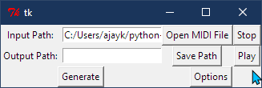
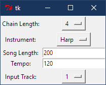

# MIDorI
Markov-Chain Based MIDI Generator

MIDorI is a program that uses Markov Chains to generate music from a seed file.
It takes the notes from an input file and figures out what notes follow each other.
The program then uses that data to randomly generate a song using the note patterns in the original. The MIDorI also creates an image using the note values of the output file as red, blue, and green values for each pixel. Several parts of the generation process can be tweaked including intstrument, tempo, and song length

## Libraries needed:
* Python-MIDI: https://github.com/vishnubob/python-midi  
* Pygame: http://pygame.org/download.shtml  
* Python Image Library: http://effbot.org/downloads#pil  

## Instructions

1. Run MIDorI.py

2. Select a MIDI file to use as a seed, (Multiple are included with the project)
    
    2a. You can play the file using the 'Play' button next to the 'Open' Button

4. Enter a filename to save the generated music as (the extension must be *.mid)

5. Click the generate button to create a MIDI file using the input file as a markov chain seed
as well as an image generated using the notes of the output file

6. Click the second 'Play' button to listen to the output

## Options

* Chain Length: Controls the length of the markov chain, lower values cause the output to be more random, while higher values cause the output to be closer to the input song (Default: 4)

* Instrument: The instrument to use when playing the output file (Default: Harp)

* Song Length: Length of output song in notes (Default: 200)

* Tempo: the tempo of the song (Default: 120)

* Input Track: the track of the input file to sample notes from (Defaults to first non-empty track in the song)

## Screenshots

